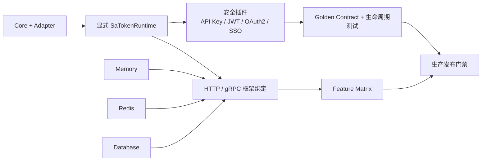

# 生产 Feature Matrix

本矩阵不使用 `cargo check --all-features` 代替真实组合验证。框架主版本 feature
可能互斥，生产门禁必须按“框架绑定 × 存储后端”逐项编译。

## 可执行门禁

| 门禁 | 命令 | 覆盖范围 |
|---|---|---|
| 快速矩阵 | `./scripts/check_feature_matrix.sh fast` | workspace、Golden Contract、四个安全插件、十个框架的 memory 组合 |
| 完整矩阵 | `./scripts/check_feature_matrix.sh full` | 快速矩阵 + 每个框架的 Redis / Database 独立组合 |
| 全量测试 | `cargo test --workspace` | workspace 单元、集成及文档测试 |
| Redis 契约 | `SA_TOKEN_TEST_REDIS_URL=redis://127.0.0.1:6379 cargo test -p sa-token-storage-redis --test redis_contract` | 原子 nonce 基础能力、Lua 保留 TTL、SCAN |
| Java Golden 更新 | `./scripts/update_java_golden.sh` | 固定 Java commit `902886c...` 的可重复导出 |

## 支持边界

| 维度 | 生产验证 | 说明 |
|---|---|---|
| Axum | `axum-08` | memory / redis / database |
| Actix-web | `v4` | `v5` 仍是前向占位，不列入生产矩阵 |
| Rocket | `v05` | memory / redis / database |
| Warp | `warp-03` | memory / redis / database |
| Poem | `poem-03` | memory / redis / database |
| Salvo | `v079` | memory / redis / database |
| Tide | `tide-017` | memory / redis / database |
| Gotham | `v074` | memory / redis / database |
| Ntex | `v212` | memory / redis / database |
| Tonic | `tonic-012` | memory / redis / database |

功能责任与语义完成度不能从“编译通过”推导，逐项状态以
[`feature_responsibility.csv`](feature_responsibility.csv) 为准。
